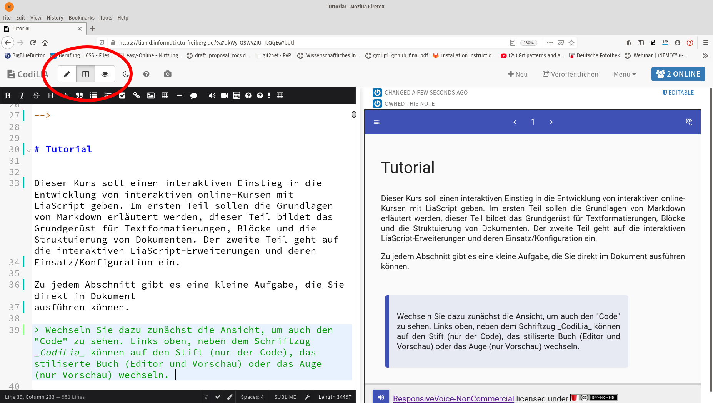
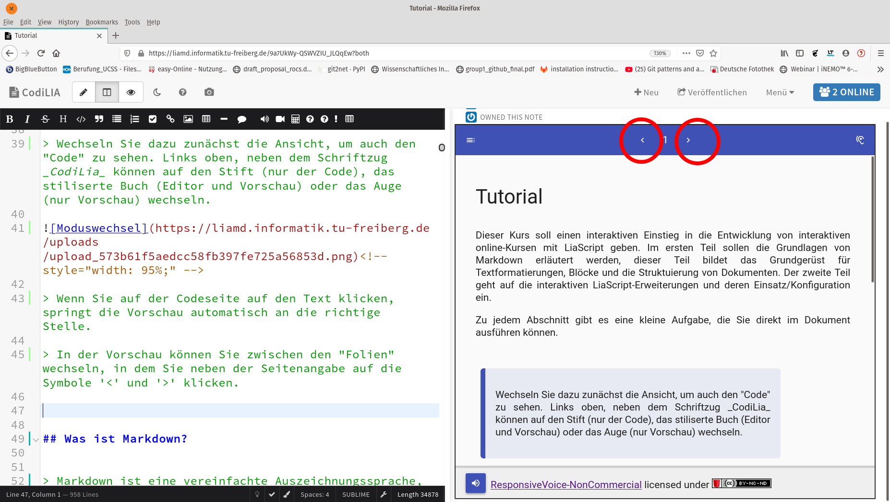

<!--
author:   Your Name

email:    your@mail.org

logo:     pic/logo.jpg

version:  0.0.1

language: de

narrator: Deutsch Female

comment:  Es wird gezeigt, wie typische bekannte Präsentationselemente auch
          mithilfe von LiaScript genutzt werden können.

tags:     LiaScript, PowerPoint, Tutorial

@btn:     <span class="lia-icon"><lia-keep>@0</lia-keep></span>

import:   https://github.com/LiaTemplates/KekuleJS
          https://github.com/LiaTemplates/VTK
          https://github.com/LiaTemplates/Algebrite
          https://github.com/LiaTemplates/ProcessingJS
          https://github.com/LiaTemplates/mec2/blob/main/README.md

-->


# Tutorial


Dieser Kurs soll einen interaktiven Einstieg in die Entwicklung von interaktiven online-Kursen mit LiaScript geben. Im ersten Teil sollen die Grundlagen von Markdown erläutert werden, dieser Teil bildet das Grundgerüst für Textformatierungen, Blöcke und die Strukturierung von Dokumenten. Der zweite Teil geht auf die interaktiven LiaScript-Erweiterungen und deren Einsatz/Konfiguration ein.

Zu jedem Abschnitt gibt es eine kleine Aufgabe, die Sie direkt im Dokument ausführen können.

> Wechseln Sie dazu zunächst die Ansicht, um auch den „Code“ zu sehen. Links oben, neben dem Schriftzug _CodiLIA_ können auf den Stift (nur der Code), das stilisierte Buch (Editor und Vorschau) oder das Auge (nur Vorschau) wechseln.

<!-- style="width: 95%;" -->

> Wenn Sie auf der Codeseite auf den Text klicken, springt die Vorschau automatisch an die richtige Stelle.

> In der Vorschau können Sie zwischen den „Folien“ wechseln, in dem Sie neben der Seitenangabe auf die Symbole `<` und `>` klicken.

<!-- style="width: 95%;" -->

**... und los geht’s. Vielen Dank, dass Sie sich an der Studie beteiligen!**

## Was ist Markdown?


> Markdown ist eine vereinfachte Auszeichnungssprache, die von John Gruber und Aaron Swartz entworfen und im Dezember 2004 mit Version 1.0.1 spezifiziert wurde. Ein Ziel von Markdown ist, dass schon die Ausgangsform ohne weitere Konvertierung leicht lesbar ist. Als Auszeichnungselemente wurden daher vor allem Auszeichnungsarten verwendet, die in Plain text und E-Mails üblich sind. Auch andere Auszeichnungssprachen mit ähnlichen Zielen zur Lesbarkeit – wie reStructuredText oder Textile – hatten Einfluss auf die Syntax.
>
> Quelle: https://de.wikipedia.org/wiki/Markdown


Überschriften

Wie Sie vielleicht schon bemerkt haben, dienen # (Hash-tags) der Strukturierung. Die Anzahl direkt aufeinander folgender definiert dabei den Grad der Überschrift, diese werden durch ein Leerzeichen von der Überschrift abgegrenzt.

------------------------

Aufgabe:

Versuchen Sie selbst die obere Überschrift durch vorangestellte # hervorzuheben und beobachten Sie den Effekt!

### Texte und Formatierungen

Ein Absatz sowie weitere Markdown-Blöcke, die wir noch kennenlernen werden, werden durch eine Leerzeile voneinander abgetrennt. Dieser gesamte Textblock wird somit als ein Absatz interpretiert.

Punkte in einer Liste werden durch ein vorangestelltes *, -, oder + definiert:

* Eine Aufzählung beginnt immer mit dem ersten Punkt.
* Weitere Punkte können auch aus mehreren Absätzen bestehen.

  Diese müssen nur durch einen entsprechenden Einschub gekennzeichnet werden

* Eine Aufzählung kann auch mehrere Unterpunkte enthalten:

  + Diese müssen nicht zwangsläufig mit einem * beginnen.
  + Es hat sich nur eingebürgert, für verschiedene Tiefen unterschiedliche Zeichen zu nutzen

------------------------

Aufgabe:

Fügen Sie noch weiter Aufzählungen hinzu, bzw. versuchen Sie unterschiedliche Anfangszeichen…

------------------------

Aufgabe:

Markdown unterstützt auch nummerierte Aufzählung, hierfür werden einfach Zahlen mit einem abschließenden Punkt verwendet, wie unten dargestellt. Überführen Sie die obere „ungeordnete Liste“ in eine nummerierte Liste. Beachten Sie den richtigen Einschub.

1. Erstens
2. Zweitens
3. ...

### Formatierungen

Manchmal sollen Elemente im Text hervorgehoben werden, kursiv, dick, hochgestellt, durchgestrichen, unterstrichen, unformatiert, usw. Markdown bietet hierfür unterschiedliche Schreibweisen an:

* `code`: diese erste Darstellung eignet sich besonders für Code-Fragmente oder Elemente die nicht weiter vom Markdown-Interpreter behandelt werden sollen und ggf. auch Sonderzeichen enthalten.

* kursiv: hierfür wird das entsprechende Wort oder er Text entweder durch `*` oder `_` „eingeklammert“. Versuchen Sie das Wörtchen kursiv kursiv hervorzuheben.

* dick: im Prinzip ist dieses Element doppelt so wichtig, deswegen nutzt man hierfür entweder `**` oder `__`. Versuchen Sie beides um das Wörtchen dick entsprechende hervorzuheben.

* dick und kursiv: wenn wir die bisherige Vorgehensweise verfolgen, welches wäre dann die richtige Schreibweise um beides zu erreichen?

* Aufgabe: Falls Sie WhatsApp nutzen, dann können Sie gleich versuchen einige Nachrichten mit diesen Formatierungen zu versehen. WhatsApp unterstützt einen kleinen Teil der Markdown-Syntax.

* durchgestrichen: wenn sie eine Tilde `~` nutzen, genauso wie Sie es für die kursive Formatierung genutzt haben, so können Sie Texte markieren, die durchgestrichen dargestellt werden sollen.

* unterstrichen: nutzen Sie zwei Tilden…

* durchgestrichen und unterstrichen: wenn Sie der Markdown-Logik weiter folgen, wie könnte dies erreicht werden ;-)

* hochgestellt: zuletzt, nutzen sie das folgende Zeichen `^` um einen Text hochgestellt darzustellen und kombinieren sie es mit der Syntax für dick und durchgestrichen

### Hervorhebungen

> Wenn ein ganzer Text hervorgehoben werdeb soll, dann können sie ein `> ` voranstellen.
>
> **Im weiteren Vorgehen, wird dies genutzt werden, um Aufgaben hervorzuheben. **

### Verweise

Nichts funktioniert im Internet ohne Verweise/Links und Markdown unterstützt verschiedene Formen, direkte und formatierte. Sie können überall im Text die gesamte Adresse einer Webseite einfügen, wenn dies mit http oder https beginnt und das Muster einer Web-Adresse entspricht, dann wird diese auch als klickbarer Verweis dargestellt. Das folgende Beispiel zeigt den direkten Link zur interaktiven LiaScript Dokumentation:

https://liascript.github.io/course/?https://raw.githubusercontent.com/liaScript/docs/master/README.md#1

Zugegeben, das sieht nicht ganz hübsch aus für überlange Adressen und stört ggf. beim Lesefluss. Deshalb bietet Markdown noch die Möglichkeit Verweise zu formatieren. Das Muster hierfür sieht wie folgt aus `[name](url)`. In eckigen Klammern wird nun der neue Kurzname für den Verweis dargestellt und in runden Klammern die Adresse.

> **Aufgabe:** Versuchen Sie den oberen Verweis formatiert darzustellen mit einem Namen Ihrer Wahl, dieser kann auch dick oder/und kursiv und weiteres sein…

Wenn Sie auf andere Abschnitte im Dokument verweisen wollen, so können sie auch relative Verweise nutzen. Hierfür muss die URL in einem _formatierten_ Verweise nur durch die entsprechende `#Überschrift-ohne-Leerzeichen` ersetzt werden. Leerzeichen werden durch `-` ersetzt und es wird nur eine `#` vorangestellt. Anstatt der Überschrift können Sie auch einfach die Nummer der Folie verwenden.

> **Aufgabe:** Versuchen Sie einen Verweis auf den Abschnitt Formatierungen zu erzeugen.

#### Bilder

Bei Bildern handelt es sich um einen Sonderfall eines Verweises, der nicht auf eine fremde Webseite, sondern auf eine Ressource zeigt, die im Dokument dargestellt werden soll. Deswegen wird es mit einem vorangestellten Ausrufezeichen `!` markiert.

> **Aufgabe:** Bringen Sie den unteren Verweis dazu, dass er als Bild angezeigt wird.
>
> Was passiert mit dem Verweis-Titel? Wenn Sie versuchen die Adresse des Verweises etwas zu verändern, sodass es nicht mehr auf ein Bild zeigt, dann erscheint der Titel wieder und gibt zumindest eine Hilfestellung, was zu sehen wäre, wenn die Adresse nicht erreichbar ist. Bedenken Sie diesen Sachverhalt, wenn Sie Dokumente erstellen:
>
> __Kein Teil ist unnütz__


[Markdown Bild](https://upload.wikimedia.org/wikipedia/commons/4/48/Markdown-mark.svg)

> Der **Name** eines Verweises kann auch ein Bild sein (`[name](url)`). Versuchen Sie, ein Bild als Verweis zu zeigen, indem Sie die Schreibweise für einen Bild-Verweis innerhalb eines normalen Verweises benutzen.

[Name](#verweise)

### Code

Sie können natürlich auch direkt HTML in den meisten Markdown-Interpretern nutzen und darstellen. Hierfür sei auf die deutsche Webseite [selfhtml](https://wiki.selfhtml.org/) verwiesen. Jedoch soll es in diesem Abschnitt darum gehen, wie HTML-Element oder Fragmente anderer Programmiersprachen beispielhaft dargestellt werden können, sodass sie **Nicht** vom Markdown-Interpreter umformatiert werden, wie das untere Beispiel zeigt.

In Markdown können hierfür drei aufeinander folgende Backticks (\`) genutzt. Auf einer deutschen Tastatur ist das die Taste rechts neben dem **[ ß ]**, wobei die Tasten **[Shift] [ \` ]** gemeinsam gedrückt werden müssen.

> **Aufgabe:** Fügen Sie drei Backticks oberhalb des HTML-Schnipsels und drei unterhalb ein, um den Abschnitt als Code-Segment zu markieren und beobachten Sie, was passiert!


<h2>
  <b style="color: green">LiaScript-ruleZ</b>
</h2>


Jetzt wäre es natürlich auch schön, wenn es sowas wie Syntax-Highlighting gäbe, um den Code auch leserlicher darzustellen. Markdown bietet hierfür die Möglichkeit Sprachkürzel/Hinweise anzugeben, wie html, js, cpp, java, yaml, xml. Dieser Hinweis muss nur hinter den oberen Backticks in der gleichen Zeile angegeben werden und der Code-Block wird entsprechende farblich formatiert dargestellt.

> **Aufgabe:** Nachdem Sie selber die entsprechenden Hinweise für das obere Beispiel gegeben haben, versuche sie doch aus dem Internet ein paar C++ oder Java oder Python oder eine andere Sprache als Markdown-Block darzustellen.

### Tabellen

Wie würden Sie eine Tabelle mit nur einer Schreibmaschine darstellen? Wahrscheinlich so, wie es unten abgebildet ist.


| Kopf 1 | Kopf 2 | Kopf 3 |
|:------ |:------:| ------:|
| Item 1 | Item 2 | Item 3 |
| ...    |  ...   |    ... |

* Zellen werden mit senkrechten `|` abgetrennt
* Die erste Zeile bildet den Tabellenkopf
* die zweite Zeile definiert anhand der Position der Doppelpunkte `:` wie die Inhalte der Spalten angeordnet werden sollen:

  * linksbündig: `:---`
  * rechtsbündig: `---:`
  * zentriert: `:---:`

> **Aufgabe:** Erweitern Sie die Tabelle um mehrere Zeilen und Spalten, fügen Sie verschieden lange Inhalte/Formatierungen ein und verändern sie die Ausrichtung der Spalten.


## Was ist LiaScript?

Markdown wird vor allem zur Erstellung von statischen Texten und zum Bloggen geeignet, LiaScript erweitert diese Syntax um verschiedene interaktive Elemente, wie Animationen, Sprachausgaben, Quizze, Multimedia, ASCII-Art, interaktive Tabellen und Programmierung, sowie vieles mehr auf das in den folgenden Abschnitten näher eingegangen werden soll…

LiaScript unterstützt zurzeit drei Darstellungs-Modi, zwischen diesen kann der Nutzer durch Klicken auf den Button rechts oben in der Menüleiste wechseln:

* @btn(book)
  **Lehrbuch:** In diesem Modus existieren keine Animationen und Textausgaben, alle Inhalte werden direkt angezeigt.

* @btn(hearing)
  **Präsentation:** Hier werden Animationen mit Sprachausgaben kombiniert dargestellt. Dieser Modus soll eine Art interaktiven Video-Screencast abbilden.

* @btn(visibility)
  **Folien:** Dieser Modus ähnelt dem Präsentations-Modus, jedoch werden Sprachausgaben hier, im unteren Teil der Darstellung, direkt dargestellt.

Im Folien- und Präsentationsmodus kann die Sprachausgabe den Button [@btn(volume_up)] im unteren Teil aus- bzw. eingeschaltet werden. Dies ist von Nutzen, falls die Inhalte als Präsentation aber ohne Sprachausgabe angezeigt werden soll.

> **Aufgabe:** Stellen Sie sicher, dass Sie sich für die nächsten Schritte im Präsentations-Modus und stellen sie die Sprachausgabe ein.

### Zunächst ein paar Infos

Wenn Sie an den Anfang dieses Dokumentes gehen (Zeile 0), dann sehen sie einen HTML-Kommentar, der wie der folgende aussieht. Dieser Kommentar enthält verschiedene Standard-Informationen wie author, email, etc. Diese Informationen werden Ihren Nutzern angezeigt, wenn diese auf den Informations-Button [@btn(info)] unterhalb des Inhaltsverzeichnisses klicken.


``` markdown
<!--
author:   Your Name

email:    your@mail.org

logo: https://upload.wikimedia.org/wikipedia/commons/2/2a/Corporate_Woman_Giving_a_PowerPoint_Presentation.svg

version:  0.0.1

language: de

narrator: Deutsch Female

comment:  Es wird gezeigt, wie typische bekannte Präsentationselemente auch
          mithilfe von LiaScript genutzt werden können.

tags:     LiaScript, PowerPoint, Tutorial

-->
```

> **Aufgabe:** Vervollständigen Sie author, email, tags, und comment mit Ihren Informationen. Über logo können Sie ein eigenes Logo definieren, dass auf der Kurs-Karte angezeigt wird.
>
> Wechseln Sie dann auf ihre Kurs-Übersicht, indem sie links oben auf [CodiLIA] klicken und schauen was passiert ist.

Weitere Einstellungen:

* language: sorgt dafür, dass alle Bezeichner und Hilfen deutsch dargestellt werden, Sie können auch en, ru, uk, es, .. wählen um andere Lokalisationen zu definieren
* narrator: definiert die Standard-Stimme für die Sprachausgabe. Diese lassen wir im Moment noch eingestellt auf `Deutsch Female`

### Animationen

Es kann nützlich sein, den Nutzer nicht direkt mit überladenen Folien zu überfordern, sondern Informationen Stück für Stück einzublenden, bzw. Elemente auch wieder zu entfernen. In LiaScript wird die folgende Notation genutzt:


* Einblenden: `{{2}}`
* Ein- und Ausblenden: `{{1-3}}`


Diese doppelt geschweiften Klammern müssen vor jedem Markdown-Block aufgeführt werden. Die erste Zahl definiert bei welchem Fragment ein Element erscheint und die zweite optionale Zahl definiert, wann ein Element wieder verschwinden soll.

Damit die Darstellung auch im Text optisch ansprechender dargestellt wird, können auch mehrere Leerzeichen dem Animations-Kommando vorangestellt werden. Nummern können mehrfach genutzt werden um verschiedene Blöcke gleichzeitig erscheinen und verschwinden zu lassen.


> **Aufgabe:** Lassen Sie alle Absätze und Aufzählung schrittweise erscheinen und verschieden wieder verschwinden. Kopieren Sie auch die Tabelle aus dem Abschnitt [Markdown-Tabellen](#Tabellen) und blenden sie diese ein bzw. aus.


#### Mikro-Animationen

Es kann auch vorkommen, dass nur ein Wort, ein Bild oder ein anderes Element innerhalb eines Blocks ein und ausgeblendet werden soll. Nutzen sie hierfür die folgende Notation, zwei nebeneinander stehende geschweifte Klammer-Blöcke:

* Einblenden: `{2}{kleine __Markdown__-Elemente}`
* Ein- und Ausblenden: `{1-3}{kleine __Markdown__-Element}`

> **Aufgabe:** Lassen Sie das Code-Element hinter den Doppelpunkten in der oberen Aufzählung erscheinen und verschwinden, fügen sie auch ihre Tabelle ein und verändern sie die Inhalte der Zellen.

**Block und Mikro-Animationen können auch kombiniert eingesetzt werden.**

### Sprachausgaben

Die derzeitige Standard-Sprachausgabe ist auf `Deutsch Female` eingestellt. Für die Sprachausgabe wird die API von https://responsivevoice.org verwendet. Alle dort aufgeführten Sprecher können in LiaScript genutzt werden.


Verfügbare Stimmen: [Liste](https://liascript.github.io/course/?https://raw.githubusercontent.com/liaScript/docs/master/README.md#120)

Mithilfe der Notation `--{{1}}--`, die wie eine Animation einem Absatz vorangestellt wird, können Texte vorgelesen werden. Die Nummer definiert das entsprechende Fragment. Wird keine andere Stimme gewählt, dann wird die Standard-Stimme genutzt, ansonsten können Sie die Stimme auch je Absatz durch `--{{2 US English Male}}--` angeben.

> **Aufgabe:** Vertonen Sie die unteren Absätze mit den entsprechenden Stimmen, Englisch und Russisch, suchen Sie hierfür nach den entsprechenden Stimmen in der Liste und probieren Sie ggf. unterschiedliche Stimmen mit verschiedenen Sprachen aus.


The entire ***Markdown*** paragraph right below the effect definition in double minus notation is sent to responsivevoice to speak the text out loud. If you click on the ear button at the navigation panel, then this paragraph gets rendered at the place where it is defined.

Первоначально создан в 2004 году Джоном Грубером (англ. John Gruber) и Аароном Шварцем. Многие идеи языка были позаимствованы из существующих соглашений...

#### **Aufgabe**

> Nutzen Sie diesen Abschnitt um eigenständig verschiedene Animationen mit Sprachausgaben zu kombinieren.
>
> Untersuchen Sie welchen Einfluss der Darstellungsmodus auf die Ausgabe hat!


#### Bedingte Ausgaben

Für das Erlernen einer Sprache, bzw. um verschiedene Aufgabenstellungen zu vertonen, kann es hilfreich sein einen Abspiel-Button für verschieden Segmente zu haben. Dieser kann als Kombination zwischen Effekt und Sprache gesehen werden. Auch hierfür wird die doppelt geschweifte Klammer-Notation genutzt, nur das diese um einen zusätzlichen Play-Button erweitert werden:

* Block: `{{|>}}` oder `{{!>}}`
* Mikro: `{|>}{Hallo Welt}`

Sie können hier ebenfalls unterschiedliche Stimmen verwenden und diese Elemente auch wie Animationen ein und ausblenden.

> **Aufgabe:** Spielen Sie mit ein paar Einstellungen und lassen Sie sich kleine Textstellen vorlesen, bzw. kombinieren Sie diese mit Animationen.


### Multimedia

Die Integration von Audio oder Filminhalten funktioniert genauso wie wir bereits [Bilder](#Bilder) und [Verweise](#Verweise) eingefügt haben. Der einzige Unterschied ist, dass wir hierfür noch einen anderen Marker voranstellen:

* Audio: `?[alt-info](url)`
* Video: `!?[alt-info](url)`

Vereinfacht kann man sich auch das Fragezeichen als Ohr vorstellen und bei Videos handelt es sich um eine Kombination aus Bildern und Ton. Es können entweder Verweise auf eine mp3, avi, etc. direkt gesetzt werden oder bei gewissen Seiten wie YouTube oder Soundcloud, kann die URL des Beitrages auch direkt genutzt werden.

> **Aufgabe:** Erstellen Sie zunächst einen Link auf ein YouTube-Video ihrer Wahl und binden Sie das Video dann auch mit der obigen Notation direkt ein. Versuchen Sie das Gleiche mit dem folgenden Soundcloud-Stück:
>
> https://soundcloud.com/safyeldin/johannes-brahms-hungarian-dance-no-5

#### Styling

<!-- style="color: red; width: 45%; font-size: 24px; float: left" -->
Bilder, Videos, ja selbst Tabellen und Verweise, im Grunde alles kann noch nachträglich mit den Mitteln von HTML bearbeitet werden. Wenn Sie einen HTML-Kommentar einem Markdown Block voranstellen dann gelten die Definition für den gesamten Block, hängen Sie es an, dann gilt es nur für **das eine Element**<!-- style="color: green" -->. Dies eignet sich vor allem für Bilder um variable Breiten und Höhen zu definieren, egal wie groß der Bildschirm ist.


<!-- style="float: right; width: 45%; padding-top: 25px" -->


<!-- style="float: left; width: 100%; text-align: center" -->
Weitere Informationen zu CSS-Styling und HTML-Attributen finden Sie unter: https://www.w3schools.com/Css/


### Quizze

Es ist nachgewiesen, dass Studenten bessere Ergebnisse erzielen, wenn Sie die Möglichkeit haben, sich selber zu prüfen oder gerade gelerntes direkt anzuwenden. Quizze sind ein ideales Werkzeug für das schnelle überprüfen des Verständnisses. In LiaScript gibt es derzeit 4 verschiedene Möglichkeit von Quizzen sowie weitere Optionen. In den folgenden Abschnitten wollen wir kurz auf die wichtigsten eingehen.

#### Texteingaben

Eine Texteingabe ist im Grunde nur ein auf eine Frage folgendes Eingabefeld, bei dem geprüft wird, ob der eingegebene Text mit einer Lösung übereinstimmt. In LiaScript wird dazu die folgende Notation verwendet (doppelt eckige Klammern):

    `[[Lösung]]`

> **Aufgabe:** Entfernen Sie die beiden Backticks (schrägen Hochkommas), und verändern Sie die Lösung. Definieren Sie eine eigene „Lösung“ eine geeignete Frage im eigenständigen Absatz.


#### Single Choice

Es werden mehrere Lösungsmöglichkeiten vorgegeben, üblicherweise werden solche Aufgaben im Browser über sogenannte Radio-Buttons dargestellt. In LiaScript wird diese Notation einfach übernommen und mithilfe von runden Klammern innerhalb der eckigen angezeigt und das X markiert die einzig richtige Lösung:

    [( )] Option 1
    [(X)] <-- **Die richtige Auswahlmöglichkeit**
    [( )] Eine weitere falsche Option

> **Aufgabe:** Fügen Sie noch weitere Optionen ein, bzw. verändern Sie die Position der Lösung.

#### Multiple Choice

Es werden mehrere Lösungsmöglichkeiten vorgegeben, von denen auch mehrere auswählbar sind. Diese Aufgaben werden zumeist durch sogenannte Checkboxen abgebildet, die in LiaScript wie folgt abgebildet werden:


    [[X]] **<-- richtig**
    [[ ]] falsch
    [[ ]] **<-- richtig**
    [[X]] falsch

> **Aufgabe:** Passen Sie das obere Quiz an, damit die Lösung den Vorgaben entspricht. Fügen Sie ggf. weitere Optionen zu, bzw. entfernen Sie alle bis auf eine.

#### Matrix

Bei dieser Darstellung werden die beiden zuvor vorgestellten Quizze in einer zwei-dimensionalen Matrix kombiniert. Die oberste Zeile definiert die möglichen Optionen, während die Zeilen Multiple und Single Choice Quizze kombinieren.

    [ [head1] [ ;-) ] [ Option3 ] ]
    [   ( )     ( )       (X)     ]  <-- Single Choice
    [   [ ]     [X]       [X]     ]  <-- Multiple Choice

#### Weitere Optionen

Zu Quizzen können verschiedene weitere Hilfen hinzugefügt werden, sowie erweiterte Auflösungen. Die vorgestellten Anpassungen können allen Quiz-Typen angefügt werden…

##### Hilfen

Gegebenenfalls kann es notwendig sein, dass Hilfen/Tipps zu den Quizzen hinzugefügt werden sollen, sodass der Nutzer selber entscheiden kann, sich eine Hilfe geben zu lassen, bevor er/sie auf den Auflöse-Button klickt.

Wie heißt der Markdown Dialekt, der hier genutzt wird:

    [[LiaScript]]
    [[?]] Bitte achten Sie auf die korrekte Schreibweise
    [[?]] Die Lösung beginnt mit Lia.....


> **Aufgabe:** Fügen Sie noch einen weiteren Hinweis hinzu. Wenn sie wollen, dann können Sie auch Hinweise an die vorhergehenden Quizze anfügen.

##### Auflösungen

Mithilfe von zwei Linienzügen, die durch mindestens drei aufeinander folgenden `***` definiert werden, können erweiterte Auflösungen definiert werden, die mehrere Markdown-Blöcke enthalten können. Diese werden nur gezeigt, falls der Nutzer die richtige Lösung gegeben hat, bzw. auf Auflösungen klickt.

    [[LiaScript]]
    [[?]] Bitte achten Sie auf die korrekte Schreibweise
    [[?]] Die Lösung beginnt mit Lia.....
    **************************************************
    LiaScript ist eine interaktive Erweiterung zu
    Markdown, zur Entwicklung interaktiver und freier
    Lehrinhalte. Mehr Informationen finden Sie unter:

    https://LiaScript.github.io

                    Nur ein weiteres Diagramm
    1.9 |
        |                 ***
      y |               *     *
      - | r r r r r r r*r r r r*r r r r r r r
      a |             *         *
      x |            *           *
      i | B B B B B * B B B B B B * B B B B B
      s |         *                 *
        |**  * *                       * *   *
     -1 +------------------------------------
        0              x-axis               1

    **************************************************

### ASCII-Art

In LiaScript existiert die Möglichkeit mit dem ASCII-Zeichensatz, sprich nur mit den Zeichen der Tastatur (oder einem erweiterten Zeichensatz) schnell Bilder und Skizzen zu malen, ohne das ein zusätzliches „externes“ Tool genutzt werden muss.

**Diagramme:**

Zum einen können mit einem stilisiertem Diagramm schnell Kurvenverläufe oder Messpunkte dargestellt werden. Die Farben und Symbole werden durch die verwendete Zeichen definiert. Mit `B B B B B` kann z. B. eine blaue Linie mit großen Punkten gezeichnet werden.


                 Combining dots and polylines
    1.9 |
        |     DOTS
      y |                                    *
      - |
      a |                         *
      x |                  *
      i |         *
      s |
        |*
     -1 +------------------------------------
        0            x-axis                 1

> **Aufgabe:** Zeichnen Sie im oberen Diagramm zum Beispiel mit kleinen r’s und mit großen R’s je eine Linie und klicken Sie dann auf das „store“ Symbol um ihr Bild zu speichern.


**Real ASCII-ART:**

Ein Markdown Code-Block wird mit dem Code-Wort `ASCII` markiert, damit der Inhalt als Bild dargestellt wird:

``` ascii
         +-------------+       .--------------.
 +------#|    Box 1    |------*|    Box 2     +-------.
  \      +-------------+       '-o------------'       |
   \                            /                     |
    ^                          /                ______|______
     \                        v                |      V      |
      +--- ein ---<--- Kreislauf ---O----------|    Box 3    |
                                               |_____________|
```

Wenn es für Sie interessant ist, dann können Sie unter dem folgenden Link noch weitere Möglichkeiten/Inspirationen sehen:

https://github.com/andre-dietrich/elm-svgbob

### Tabellen

Markdown-Tabellen können auch als Datensätze wie in Excel interpretiert werden und direkt als Diagramme dargestellt werden. In LiaScript wird automatisch, anhand der Struktur der Daten, versucht eine geeignete Darstellung zu identifizieren. Im besten Fall müssen Sie nichts tun und die entsprechende Visualisierung wird gewählt, ansonsten können Sie auch selber definieren, welche Darstellungsform gewählt werden soll.

#### Linien-Diagramme

Oberhalb der Tabelle in LiaScript befindet sich ein kleines Diagramm-Symbol, das andeutet, dass Linien-Diagramme für die Darstellung angenommen werden. Wenn Sie darauf klicken, dann wechselt die Darstellung auf das entsprechende Diagramm.

|   x |  y1 |  y2 |  y3 |
| ---:| ---:| ---:| ---:|
|   1 |   1 |   1 |  15 |
|   2 |   2 |   4 |  15 |
|   3 |   3 |   9 |  15 |
|   4 |   4 |  16 |  15 |
|   5 |   5 |  25 |  15 |
|   6 |   6 |  36 |  15 |

#### Balken-Diagramme

In den meisten Diagrammen wird die erste Spalte als x-Achse gesehen, sollte diese keine Zahlen enthalten, jedoch über „Kategorien“ verfügen, dann wird eine andere Darstellungsform gewählt, im unteren Beispiel handelt es sich um ein Balkendiagramm.

| Animal          | weight in kg | Lifespan years | Mitogen |
| --------------- | ------------:| --------------:| -------:|
| Mouse           |     0.028 kg |              2 |      95 |
| Flying squirrel |     0.085 kg |             15 |      50 |
| Brown bat       |     0.020 kg |             30 |      10 |
| Sheep           |        90 kg |             12 |      95 |
| Human           |        68 kg |             70 |      10 |

> **Aufgabe:** Sortieren Sie die Spalten in der Tabellen-Darstellung und schauen Sie, welchen Effekt das auf das Bild hat.


#### Torten-Diagramme

Eine Tabelle mit nur einer Zeile wird als Torten-Diagramm dargestellt.

| Music-Style 1994 | Classic | Country | Reggae | Hip-Hop | Hard-Rock | Samba |
|:---------------- | -------:| -------:| ------:| -------:| ---------:| -----:|
| Student rating   |      50 |      50 |    100 |     200 |       350 |   250 |

Das Gleiche gilt für die untere Tabelle, mit dem Kommando `<!-- data-transpose -->` wird nur gesagt, das die Daten für die Darstellung transponiert werden sollen, um so eine bessere Lesbarkeit der Tabelle zu geben. Im Weiteren zeigt die Tabelle, wie Mikro-Animationen eingesetzt werden können, um die Darstellung zu verändern.

<!-- data-transpose -->
| Music-Style {0-1}{1994} {1}{2014} |      Student rating |
|:--------------------------------- | -------------------:|
| Classic                           |   {0-1}{50} {1}{20} |
| Country                           |   {0-1}{50} {1}{30} |
| Reggae                            |                 100 |
| Hip-Hop                           | {0-1}{200} {1}{220} |
| Hard-Rock                         | {0-1}{350} {1}{400} |
| Samba                             | {0-1}{250} {1}{230} |

> **Aufgabe:** Schalten Sie im Präsentationsmodus weiter und beobachten Sie die unterschiedliche Darstellung in der Tabelle und im Diagramm.

#### Mehr Diagramme

LiaScript unterstützt noch mehr Diagramm-Typen unter dem folgenden Link finden Sie noch weitere Nutzungsmöglichkeiten:

<preview-lia
src="https://raw.githubusercontent.com/liaScript/docs/master/README.md"
link="https://liascript.github.io/course/?https://raw.githubusercontent.com/liaScript/docs/master/README.md#67">
</preview-lia>


### Formeln

LiaScript, wie auch mehrere andere Markdown-Dialekte, unterstützt die Nutzung von Formeln, hierbei wird auf die Möglichkeiten von KaTeX zurückgegriffen:

https://katex.org/docs/supported.html

Die folgende Darstellung zeigt nur die zwei Nutzungsmöglichkeiten, wobei die Formeldefinition entweder durch ein einfaches `$`-Zeichen oder innerhalb doppelter `$$`-Zeichen markiert wird:

* Im $ f(a,b,c) = (a^2+b^2+c^2)^3 $ Text
* Als eigenständiger Block:

  $$
   \sum_{i=1}^\infty\frac{1}{n^2}
        =\frac{\pi^2}{6}
  $$

> **Aufgabe:** Lassen Sie im folgen Text  `n= 2 \pi f` als Formel erscheinen.

Die Drehfrequenz wird wie folgt berechnet:  n = 2 \pi f


### Ausführbarer Code

Code kann direkt ausgeführt werden, indem an eine Markdown Code-Block ein `<script>...</script>` angehängt wird, das definiert, wie mit den Eingaben verfahren werden soll. Handelt es sich wie im unteren Beispiel um JavaScript, dann genügt es `@input` im script-tag einzufügen, dieser Inhalt wird dann bei jeder Ausführung mit den aktuellen Inhalten des Editors überschrieben (substituiert).

``` js
console.warn("Hallo Welt");

33*55;
```
<script>@input</script>

> **Aufgabe:** Verändern Sie das obige Programm in der LiaScript Darstellung und führen Sie es aus. Springen Sie mit den „Pfeiltasten“ in ihren Versionen vor und zurück und verändern auch diese Inhalte. Beobachten Sie wie neue Versionen angehängt werden.


#### Projekte

Sie können auch komplizierter Projekte anlegen, indem Sie mehrere Markdown Code-Blöcke direkt aneinander hängen. Zur Unterscheidung eignen sich hier auch „Dateinamen“ die mit einem vorangestellten `+` oder `-` zeigen, ob die Datei aufgeklappt, bzw. zugeklappt dargestellt werden soll. Das sScript-tag umfasst nun ein etwas kompliziertes Programm, das ausgeführt werden soll, wobei `@input(n)` angibt, welcher Inhalt wo substituiert werden soll.

``` js     -EvalScript.js
let who = data.first_name + " " + data.last_name;

if(data.online) {
  who + " is online"; }
else {
  who + " is NOT online"; }
```
``` json    +Data.json
{
  "first_name" :  "Sammy",
  "last_name"  :  "Shark",
  "online"     :  true
}
```
<script>
  // insert the JSON dataset into the local variable data
  let data = @input(1);

  // eval the script that uses this dataset
  eval(`@input(0)`);
</script>

> **Aufgabe:** Ersetzen Sie in der Datei "Data.json" den Eintrag `"online" : true` durch `"online" : false`.


### Macros & Bibliotheken

LiaScript bietet die Möglichkeit zusätzliche Funktionalität mithilfe von Macros zu definieren. Diese werden, kurz gesagt, mit einem vorangestellten `@` markiert. Einige davon haben sie schon gesehen, wie `@input`. Andere vielleicht schon selber definiert:

* `@author`
* `@email`
* `@comment`

Diese werden im Kopf der eines jeden Dokumentes definiert und können überall im Kurs verwendet werden. Diese können auch parametrisiert werden, w. z. B. das `@input` Macro. Was jedoch allen gemein ist, ist das hier eine einfache Textersetzung vorgenommen wird. Damit wird das mehrfache Schreiben komplizierter HTML- / CSS- / JavaScript- / Markdown-Ausdrücke automatisiert.

> **Aufgabe:** Entfernen Sie die Backticks in der oberen Liste und beobachten Sie was passiert. Vielleicht verändern sie auch nochmal den Autor oder Ihre E-mail.

#### Import

Sie können die Macros anderer Kurse auch in ihren eigenen Kurs importieren, dazu müssen sie nur jeweiligen Kurse mittels `import: url` eingebunden werden. Dieser Kurs importiert schon einige „Templates“, die wir auf den folgenden kurz nutzen werden.

``` md
<!--
author:   Your Name
email:    your@mail.org

...
@btn:     <span class="lia-icon"><lia-keep>@0</lia-keep></span>

import:   https://github.com/LiaTemplates/KekuleJS

-->
```

Eine kleine Sammlung verschiedener Kurse finden Sie auch unter:

https://github.com/LiaTemplates

## 🧪🧑‍🔬 Chemie

Das folgende Template bindet zwei Funktionen von KekuleJS ein, die hier definiert sind:

https://github.com/LiaTemplates/KekuleJS

* `@Kekule.molecule2d`
* `@Kekule.molecule3d`

``` xml @Kekule.molecule2d
<cml xmlns="http://www.xml-cml.org/schema">
  <molecule>
    <atomArray>
      <atom id="a1588768090561" elementType="C" x2="0.4125" y2="0.6348"/>
      <atom id="a1588768090562" elementType="C" x2="-0.4125" y2="0.6348"/>
      <atom id="a1588768090563" elementType="C" x2="-0.6674" y2="-0.1498"/>
      <atom id="a1588768090564" elementType="N" x2="0" y2="-0.6348"/>
      <atom id="a1588768090565" elementType="C" x2="0.6674" y2="-0.1498"/>
    </atomArray>
    <bondArray>
      <bond id="b1588768090566" order="S" atomRefs2="a1588768090561 a1588768090562"/>
      <bond id="b1588768090567" order="D" atomRefs2="a1588768090562 a1588768090563"/>
      <bond id="b1588768090568" order="S" atomRefs2="a1588768090563 a1588768090564"/>
      <bond id="b1588768090569" order="S" atomRefs2="a1588768090564 a1588768090565"/>
      <bond id="b1588768090570" order="D" atomRefs2="a1588768090565 a1588768090561"/>
    </bondArray>
  </molecule>
</cml>
```

> **Aufgabe:** Ersetzen Sie im oberen Code-Block das Macro `@Kekule.molecule2d` durch `@Kekule.molecule3d` und beobachten Sie, was passiert.

## 🔧🧑🏽‍🔧 Maschinenbau

https://github.com/LiaTemplates/mec2

``` json @mec2
{
  "id":"chaos-pendulums",
  "gravity":true,
  "nodes": [
    { "id":"A0","x":200,"y":400,"base":true },
    { "id":"A1","x":280,"y":480,"m":2 },
    { "id":"B1","x":279,"y":481,"m":2 },
    { "id":"C1","x":278,"y":482,"m":2 },
    { "id":"D1","x":277,"y":483,"m":2 },
    { "id":"A2","x":360,"y":560,"m":3 },
    { "id":"B2","x":359,"y":561,"m":3 },
    { "id":"C2","x":358,"y":562,"m":3 },
    { "id":"D2","x":357,"y":563,"m":3 },
    { "id":"A3","x":440,"y":640,"m":4.7 },
    { "id":"B3","x":439,"y":641,"m":4.7 },
    { "id":"C3","x":438,"y":642,"m":4.7 },
    { "id":"D3","x":437,"y":643,"m":4.7 }
  ],
  "constraints": [
    { "id":"a1","p1":"A0","p2":"A1","len":{ "type":"const" } },
    { "id":"a2","p1":"A1","p2":"A2","len":{ "type":"const" } },
    { "id":"a3","p1":"A2","p2":"A3","len":{ "type":"const" } },
    { "id":"b1","p1":"A0","p2":"B1","len":{ "type":"const" } },
    { "id":"b2","p1":"B1","p2":"B2","len":{ "type":"const" } },
    { "id":"b3","p1":"B2","p2":"B3","len":{ "type":"const" } },
    { "id":"c1","p1":"A0","p2":"C1","len":{ "type":"const" } },
    { "id":"c2","p1":"C1","p2":"C2","len":{ "type":"const" } },
    { "id":"c3","p1":"C2","p2":"C3","len":{ "type":"const" } },
    { "id":"d1","p1":"A0","p2":"D1","len":{ "type":"const" } },
    { "id":"d2","p1":"D1","p2":"D2","len":{ "type":"const" } },
    { "id":"d3","p1":"D2","p2":"D3","len":{ "type":"const" } }
  ],
  "views": [
    { "show":"pos","of":"A3","as":"trace","id":"view1","stroke":"rgba(255,0,0,.5)" },
    { "show":"pos","of":"B3","as":"trace","id":"view2","stroke":"rgba(0,255,0,.5)" },
    { "show":"pos","of":"C3","as":"trace","id":"view3","stroke":"rgba(255,255,0,.5)" },
    { "show":"pos","of":"D3","as":"trace","id":"view4","stroke":"rgba(255,0,255,.5)" }
  ]
}
```


## 📐👩‍🏫 Mathematik

https://github.com/LiaTemplates/Algebrite

``` m
(3 * x - 5x)^3 * (x + x)

60!
```
@Algebrite.eval

``` m
f=sin(t)^4-2*cos(t/2)^3*sin(t)

f=circexp(f)

defint(f,t,0,2*pi)
```
@Algebrite.eval

## 🩺🧑🏼‍⚕️ Medizin

https://github.com/LiaTemplates/VTK

Das laden des medizinischen Datensatzes kann etwas Zeit in Anspruch nehmen

@VTK.load(https://data.kitware.com/api/v1/file/58e665158d777f16d095fc2e/download)


## 🖼👩‍💻Visualisierung

``` cpp
// Global variables
float radius = 50.0;
int X, Y;
int nX, nY;
int delay = 16;

// Setup the Processing Canvas
void setup(){
  size( 400, 200 );
  strokeWeight( 10 );
  frameRate( 15 );
  X = width / 2;
  Y = height / 2;
  nX = X;
  nY = Y;
}

// Main draw loop
void draw(){
  radius = radius + sin( frameCount / 4 );
  // Track circle to new destination
  X+=(nX-X)/delay;
  Y+=(nY-Y)/delay;
  // Fill canvas grey
  background( 100 );
  // Set fill-color to blue
  fill( 0, 121, 184 );
  // Set stroke-color white
  stroke(255);
  // Draw circle
  ellipse( X, Y, radius, radius );
}

// Set circle's next destination
void mouseMoved(){
  nX = mouseX;
  nY = mouseY;
}
```
@Processing.eval
